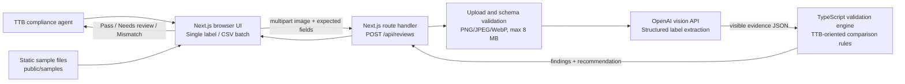

# Architecture and technology stack

Label Check is a server-rendered Next.js application with a browser-based review
workflow. It uses an OpenAI vision model only to extract visible label evidence; the
server-side validation engine deterministically assigns the recommendation. No
database or persistent user data is used.

## High-level architecture

### Request flow

1. The agent enters application values and selects a label image, or uploads a CSV
   and images for a batch.
2. The browser pairs batch rows with images by filename and sends each review as a
   multipart request.
3. The API validates the field schema, file count, MIME type, and file size.
4. The server sends the image to OpenAI with a strict JSON schema to transcribe
   visible label evidence and warning-format observations.
5. The validation engine compares that evidence with the application values and
   applies alcohol-content and government-warning rules.
6. The API returns independent results with field-level explanations. The browser
   displays them and can export batch results as CSV.

Batch work is intentionally limited to three concurrent requests in the browser and
three concurrent image analyses in the API route. A failed image produces an
individual error rather than failing the entire batch.

## Technology stack

| Layer | Technology | Purpose |
|---|---|---|
| Web framework | Next.js 16, React 19, TypeScript | User interface, routing, and server-side API route. |
| Styling | CSS in `app/globals.css` | Responsive, TTB-inspired application interface. |
| API | Next.js Route Handler on Node.js | Receives multipart uploads at `POST /api/reviews`. |
| AI extraction | OpenAI Node SDK and a vision-capable model | Extracts structured, visible evidence from each label image. |
| Validation | TypeScript in `lib/validation.ts` | Deterministic application-to-label checks and recommendations. |
| Input contracts | Zod | Validates application fields and the model extraction response. |
| CSV support | Native TypeScript parser in `lib/csv.ts` | Imports application rows and exports batch results. |
| Testing | Vitest | Unit and route-contract test coverage. |
| Linting | ESLint | Static code-quality checks. |
| Deployment | Vercel or Docker/Node.js host | Production Next.js runtime; Vercel hosts the current production app. |

## Components and responsibilities

| Location | Responsibility |
|---|---|
| `app/page.tsx` | Single-label review screen, sample selection, and result display. |
| `components/BatchValidation.tsx` | CSV import, image pairing, concurrent batch requests, and CSV export. |
| `app/api/reviews/route.ts` | Upload validation, bounded concurrent processing, and review response. |
| `lib/extractor.ts` | Server-only OpenAI client and structured vision extraction. |
| `lib/validation.ts` | Field comparisons plus warning and alcohol-content checks. |
| `lib/csv.ts` | CSV parsing, column aliases, template generation, and result export. |
| `lib/types.ts` | Shared Zod schemas and TypeScript data contracts. |
| `public/samples/` | Static fictional label images and sample applications CSV. |

## Security and operational boundaries

- `OPENAI_API_KEY` is read only by the server-side extraction module. It is never
  sent to the browser and must be configured as a deployment secret.
- The API accepts PNG, JPEG, and WebP images only, up to 20 files per request and
  8 MB per image.
- Requests, uploads, extracted evidence, and results are not persisted by the app.
- The application is decision support, not an automatic approval system. Low
  confidence and visual-format uncertainty are returned as **Needs review**.

## Deployment topology

The current production app is hosted on Vercel:
[janak-khadka-federal-build-challeng.vercel.app](https://janak-khadka-federal-build-challeng.vercel.app).

Vercel runs the Next.js application and provides the API route runtime. The route
calls the OpenAI API with the server-side `OPENAI_API_KEY`; static sample assets are
served directly from `public/samples`. The included `Dockerfile` supports an
equivalent self-hosted Node.js deployment.
