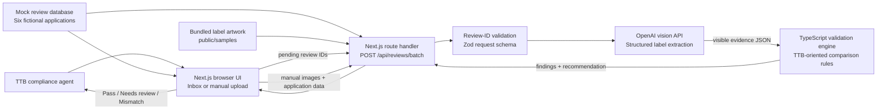

# Architecture and technology stack

Label Check is a server-rendered Next.js application with a mock review inbox and
manual single-label/CSV-batch upload paths. It uses an OpenAI vision model only to
extract visible label evidence; the server-side validation engine deterministically
assigns the recommendation. Six fictional records are seeded in a server-owned mock
database and are not persistently modified.

## High-level architecture

### Request flow

1. The agent opens the inbox and sees six pending mock notifications.
2. The agent selects **Verify labels**, and the browser sends the pending review IDs.
3. The API validates the request, retrieves application data from the mock database,
   and reads the corresponding bundled artwork on the server.
4. The server sends the image to OpenAI with a strict JSON schema to transcribe
   visible label evidence and warning-format observations.
5. The validation engine compares that evidence with the application values and
   applies alcohol-content and government-warning rules.
6. The API returns independent results with field-level explanations. The browser
   clears the pending count for this session and displays the evidence.

Batch work is intentionally limited to three concurrent image analyses in the API
route. A failed image produces an individual error rather than failing the entire batch.

## Technology stack

| Layer | Technology | Purpose |
|---|---|---|
| Web framework | Next.js 16, React 19, TypeScript | User interface, routing, and server-side API route. |
| Styling | CSS in `app/globals.css` | Responsive, TTB-inspired application interface. |
| API | Next.js Route Handler on Node.js | Receives known pending-review IDs at `POST /api/reviews/batch`. |
| Manual API | Next.js Route Handler on Node.js | Receives user-selected images at `POST /api/reviews`. |
| AI extraction | OpenAI Node SDK and a vision-capable model | Extracts structured, visible evidence from each label image. |
| Validation | TypeScript in `lib/validation.ts` | Deterministic application-to-label checks and recommendations. |
| Input contracts | Zod | Validates application fields and the model extraction response. |
| Testing | Vitest | Unit and route-contract test coverage. |
| Linting | ESLint | Static code-quality checks. |
| Deployment | Vercel or Docker/Node.js host | Production Next.js runtime; Vercel hosts the current production app. |

## Components and responsibilities

| Location | Responsibility |
|---|---|
| `app/page.tsx` | Server entry point that supplies the seeded pending notifications. |
| `components/ReviewQueue.tsx` | Notification inbox, one-click batch request, and results display. |
| `lib/mock-review-queue.ts` | Zod-validated, server-owned mock review data for six fictional labels. |
| `app/api/reviews/batch/route.ts` | Batch request validation, mock-record lookup, bounded processing, and review response. |
| `components/SingleLabelReview.tsx` | Application form, one-label upload, and evidence display. |
| `components/BatchValidation.tsx` | CSV/image pairing, manual batch requests, and CSV export. |
| `lib/extractor.ts` | Server-only OpenAI client and structured vision extraction. |
| `lib/validation.ts` | Field comparisons plus warning and alcohol-content checks. |
| `lib/types.ts` | Shared Zod schemas and TypeScript data contracts. |
| `public/samples/` | Static fictional label artwork read by the batch route. |

## Security and operational boundaries

- `OPENAI_API_KEY` is read only by the server-side extraction module. It is never
  sent to the browser and must be configured as a deployment secret.
- The batch route accepts only known mock review IDs and reads matching bundled PNGs
  on the server.
- The manual route accepts PNG, JPEG, and WebP uploads, up to 20 files per request
  and 8 MB per image.
- Requests, extracted evidence, and results are not persisted by the app; notification
  completion is browser-only and resets on refresh.
- The application is decision support, not an automatic approval system. Low
  confidence and visual-format uncertainty are returned as **Needs review**.

## Deployment topology

The current production app is hosted on Vercel:
[janak-khadka-federal-build-challeng.vercel.app](https://janak-khadka-federal-build-challeng.vercel.app).

Vercel runs the Next.js application and provides the API route runtime. The route
calls the OpenAI API with the server-side `OPENAI_API_KEY`; static sample assets are
served directly from `public/samples`. The included `Dockerfile` supports an
equivalent self-hosted Node.js deployment.
