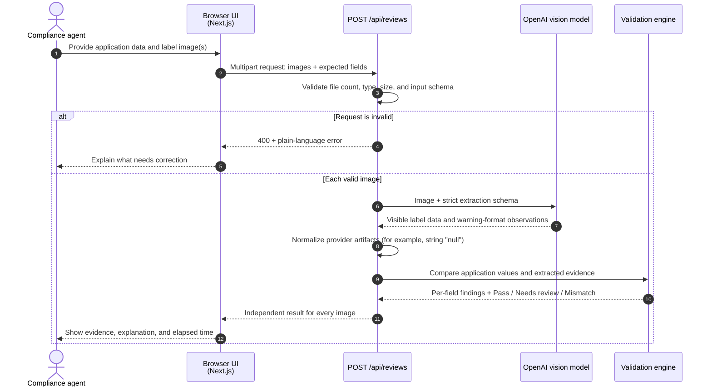
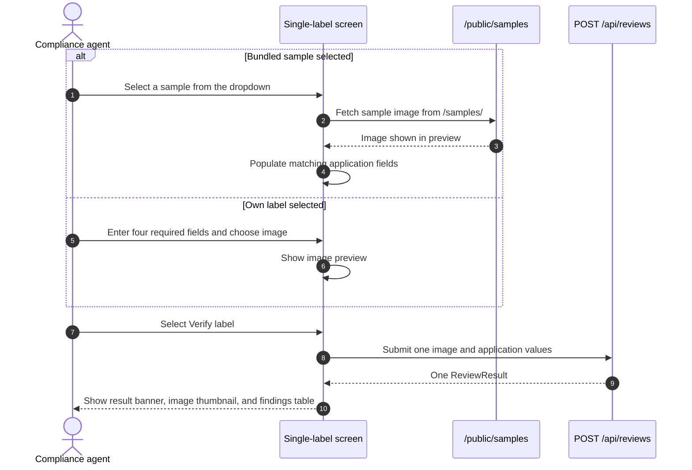
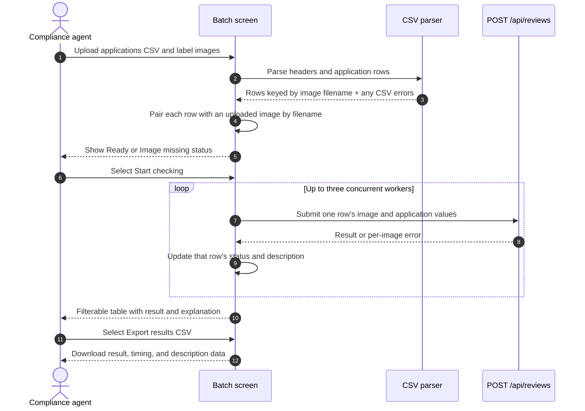

# Label Check workflow

This document describes the end-to-end behavior of the application. The system is
decision support: it extracts evidence and applies deterministic checks; a compliance
agent makes the final determination.

## Shared validation sequence

## Single-label workflow

## Batch CSV workflow

## Rule boundaries

- The model only transcribes visible evidence. It never decides approval or rejection.
- The validation engine performs text/field comparison, ABV and proof checks, and
  government-warning checks.
- Low-confidence extraction and visual uncertainty become **Needs review**.
- Uploads/results are request-scoped; the application has no persistence layer.
- Physical type size, layout, same-field-of-vision, and product-specific formula or
  import requirements remain agent review tasks.
