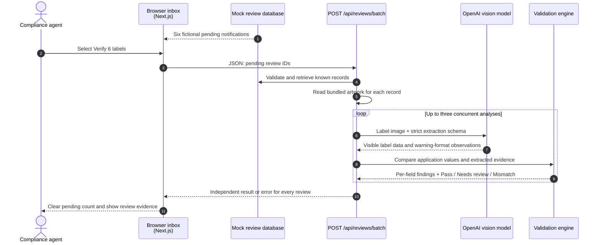

# Label Check workflow

This prototype provides decision support: it extracts visible evidence and applies
deterministic checks; a compliance agent makes the final determination.

## Mock notification and batch-review sequence

## State boundaries

- `lib/mock-review-queue.ts` contains six Zod-validated, fictional review records.
- The browser receives the display data for the six pending notifications, and sends
  only those record IDs when batch verification starts.
- The batch API retrieves application data and reads matching artwork server-side.
  The browser never uploads the images or sees the OpenAI API key.
- Results and the cleared-notification state exist only for the current page session.
  Refreshing the page restores the original six pending mock notifications.
- The model only transcribes visible evidence. It never decides approval or rejection.
  Low-confidence extraction and visual uncertainty become **Needs review**.

## Manual upload workflows

- **Upload one label:** the agent enters application data and selects one image. The
  browser sends multipart image data and expected fields to `POST /api/reviews`.
- **Upload CSV batch:** the agent provides an applications CSV and matching label
  images. The browser pairs rows by filename and sends each ready row to
  `POST /api/reviews`, up to three at a time.
- Manual uploads and their results are request-scoped. They are separate from the
  mock inbox and do not alter its seeded notification records.

## Rule boundaries

- The validation engine performs text/field comparison, ABV and proof checks, and
  government-warning checks.
- Physical type size, layout, same-field-of-vision, and product-specific formula or
  import requirements remain agent review tasks.
