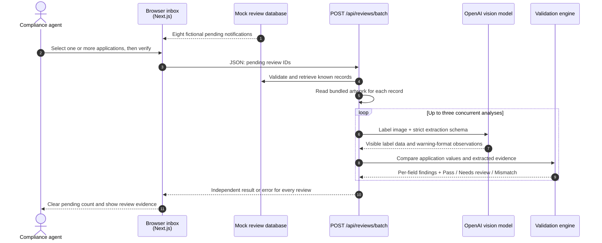

# Label Check workflow

This prototype provides decision support: it extracts visible evidence and applies
deterministic checks; a compliance agent makes the final determination.

## Mock notification and batch-review sequence

## State boundaries

- `lib/mock-review-queue.ts` contains eight Zod-validated, fictional review records,
  including glare and skewed-photo scenarios.
- The browser receives display data for the pending notifications and sends only the
  selected record IDs when batch verification starts.
- The batch API retrieves application data and reads matching artwork server-side.
  The browser never uploads the images or sees the OpenAI API key.
- `Open application` expands an in-inbox, side-by-side application and label review.
- Mock-inbox verification findings and human Approve/Reject decisions are validated
  before being restored from local storage and persist only in that browser. They are
  never sent to the server or shared with another reviewer.
- Selecting **Reject application** asks the agent to provide a reason before a
  rejection can be confirmed. The editable suggestion is based on non-passing
  verification findings; the model never makes the rejection decision.
- Selections remain temporary. The agent can use **Reset this browser's demo state**
  to remove saved mock-inbox results and decisions.
- The model only transcribes visible evidence. It never decides approval or rejection.
  Low-confidence extraction and visual uncertainty become **Needs review**.

## Manual upload workflows

- **Upload one label:** the agent enters application data and selects one image. The
  browser sends multipart image data and expected fields to `POST /api/reviews`.
- **Upload CSV batch:** the agent provides an applications CSV and matching label
  images. The browser pairs rows by filename and sends each ready row to
  `POST /api/reviews`, up to three at a time. Each result records its server-side
  processing time against a five-second response target; a 15-second hard timeout
  prevents a stalled request from blocking a worker indefinitely.
- Manual uploads and their results are request-scoped. They are separate from the
  mock inbox and do not alter its seeded notification records.

## Rule boundaries

- The validation engine performs text/field comparison, ABV and proof checks, and
  government-warning checks.
- Physical type size, layout, same-field-of-vision, and product-specific formula or
  import requirements remain agent review tasks.
- The three-worker pool is a bounded parallelism safeguard, not a durable job queue.
  A production high-volume workflow would require persistent jobs, rate-limit-aware
  retries, and monitoring.
